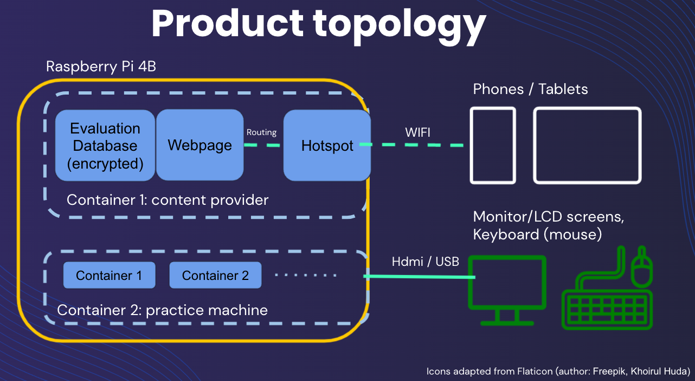

# CyberNoNet

This project is part of the Social Impact Hackathon at NYU. This repository records the technical stack relevant to the projects and the demonstration of MVP.

### Prodcut Topology

### Content Provider

- hotspot: hostapd (for AP mode), dnsmasq (for DNS and DHCP servers)
- webpage: apache http server (apache2)
- web content (see the folder **content_web**): vanilla html & CSS

### Demonstration Video

- [google drive link](https://drive.google.com/file/d/1IWl7BBn6phHEX5crfHEPFfDDBG-gVURP/view?usp=sharing)

